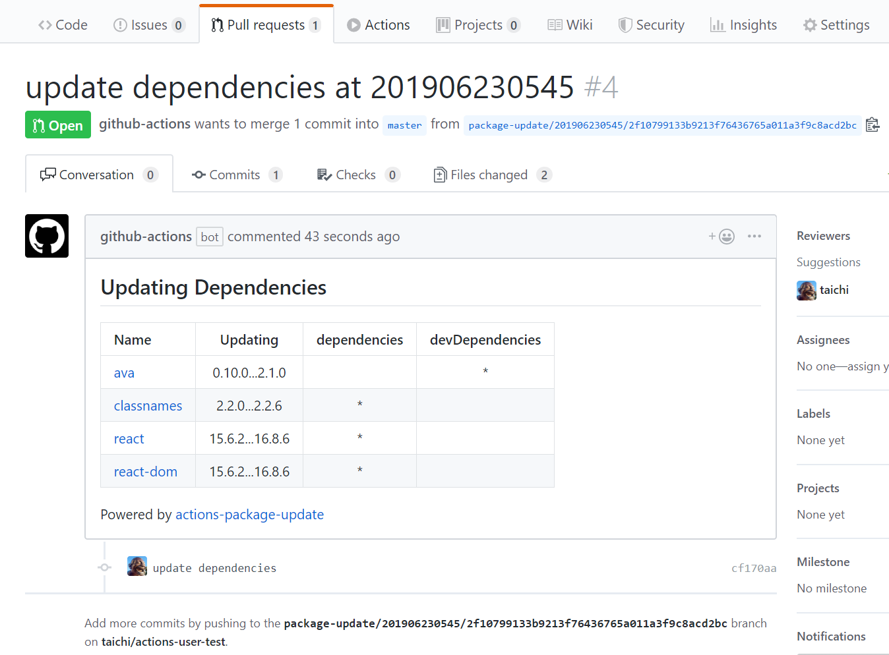
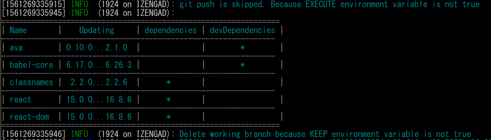

# actions-package-update

This tool keeps npm dependencies up-to-date by making pull requests from GitHub Actions or CI.



This tool is the successor of [taichi/ci-yarn-upgrade](https://github.com/taichi/ci-yarn-upgrade).

# Basic Usage
GitHub Action for package.json update.

## GitHub Actions

Below is the complete workflow example:

```yaml
name: Update

on:
  schedule:
  - cron: 0 0 * * 3
  
jobs:
  package-update:
    runs-on: ubuntu-latest
    steps:
    - uses: actions/checkout@master
    
    - name: set remote url
      run: git remote set-url --push origin https://$GITHUB_ACTOR:${{ secrets.GITHUB_TOKEN }}@github.com/$GITHUB_REPOSITORY
      
    - name: package-update
      uses: taichi/actions-package-update@master
      env:
        AUTHOR_EMAIL: john@example.com
        AUTHOR_NAME: john
        EXECUTE: "true"
        GITHUB_TOKEN: ${{ secrets.GITHUB_TOKEN }}
        LOG_LEVEL: debug
      with:
        args: -u --packageFile package.json --loglevel verbose
```

Notes:

* this workflow runs every Wednesday at midnight.
* all `args` are passed to [npm-check-updates](https://github.com/tjunnone/npm-check-updates).
* `AUTHOR_NAME` and `AUTHOR_EMAIL` are use for the commit.
* if you set `EXECUTE` as `true,` then actions-package-update makes a Pull Request.
* you must grant access using the built-in `GITHUB_TOKEN` value as above, because actions-package-update access to your repository and make Pull Request.
  * see [Storing Secrets](https://developer.github.com/actions/managing-workflows/storing-secrets/) in the docs.

### Examples

* Update `devDependencies` only

  ```yaml
  - name: package-update
    uses: taichi/actions-package-update@master
    env:
      AUTHOR_EMAIL: john@example.com
      AUTHOR_NAME: John
      EXECUTE: "true"
      GITHUB_TOKEN: ${{ secrets.GITHUB_TOKEN }}
    with:
      args: -u --packageFile package.json  --dep dev
  ```

* Use yarn upgrade

  ```yaml
  - name: package-update
    uses: taichi/actions-package-update@master
    env:
      AUTHOR_EMAIL: john@example.com
      AUTHOR_NAME: John
      EXECUTE: "true"
      GITHUB_TOKEN: ${{ secrets.GITHUB_TOKEN }}
      UPDATE_COMMAND: yarn
    with:
      args: upgrade --latest
  ```

* Use npm update

  ```yaml
  - name: package-update
    uses: taichi/actions-package-update@master
    env:
      AUTHOR_EMAIL: john@example.com
      AUTHOR_NAME: John
      EXECUTE: "true"
      GITHUB_TOKEN: ${{ secrets.GITHUB_TOKEN }}
      UPDATE_COMMAND: npm
    with:
      args: update
  ```

* Use pnpm update

  ```yaml
  - name: package-update
    uses: taichi/actions-package-update@master
    env:
      AUTHOR_EMAIL: john@example.com
      AUTHOR_NAME: John
      EXECUTE: "true"
      GITHUB_TOKEN: ${{ secrets.GITHUB_TOKEN }}
      UPDATE_COMMAND: pnpm
    with:
      args: update
  ```

* Use ncu with yarn workspaces

  In your workspace root, run:

  ```sh
  yarn add -DW wsrun npm-check-updates
  ```

  Add this script to your root package.json:

  ```json
  {
    "ncu-all": "ncu -u --packageFile package.json && wsrun --serial ncu -u --packageFile package.json"
  }
  ```

  Add this config:

  ```yaml
  - name: package-update
    uses: taichi/actions-package-update@master
    env:
      AUTHOR_EMAIL: john@example.com
      AUTHOR_NAME: John
      EXECUTE: "true"
      GITHUB_TOKEN: ${{ secrets.GITHUB_TOKEN }}
      UPDATE_COMMAND: yarn
    with:
      args: ncu-all
  ```

## Local or CI Server|Service

### Install

    yarn global add actions-package-update

or

    npm install actions-package-update -g

or

    pnpm add --global actions-package-update
### Setting Environment Variables

* Required Variables
  * `GITHUB_TOKEN`
    * GitHub personal access token is required for sending pull requests to your repository
    * [Creating an access token for command-line use](https://help.github.com/en/articles/creating-a-personal-access-token-for-the-command-line)
  * `AUTHOR_NAME` and `AUTHOR_EMAIL`
    * this command use there variables for commit
  * `EXECUTE`
    * By default, actions-package-update runs in dry-run mode.
    * if you set to `EXECUTE=true`, then this command push branch to remote, and make a pull request.

### Command Behavior

This command works locally and output result to standard output.



# Optional Configurations

* `BRANCH_PREFIX`
  * specify working branch prefix. default prefix is `package-update/`.
* `COMMIT_MESSAGE`
  * specify the commit message. default message is `update dependencies`.
* `COMMIT_FILES`
  * a space separated list of files that will be added to the commit. Leave empty to use `git add --all`.
    * for example, you can use `"package.json package-lock.json"` to ensure only these two files gets added to the commit
* `UPDATE_COMMAND`
  * specify the command for update. default command is `ncu`.
    * for example, you may set to `yarn` or `npm`.
* `WITH_SHADOWS`
  * if you specify this option, shows shadow dependencies changes.
  * default value is `false`.
* `KEEP`
  * if you specify this option, keep working branch after all.
  * default value is `false`.
  * this is useful for debugging.
* `LOG_LEVEL`
  * One of `fatal`, `error`, `warn`, `info`, `debug`, `trace` or `silent`.
  * default value is `info`.
  * if you want to know this tool's internal states, set to `debug`.
* `WORKING_DIR`
  * specify the working dir.
  * default value is `./`.
* `SET_NODE_VERSION`
  * specify the node version you want to run on.
  * default value is `latest`.

# Development

## Setup

Run these commands in the project root dir.

    yarn install
    code .

## Release

* release package to npmjs

    yarn publish

* edit Dockerfile
